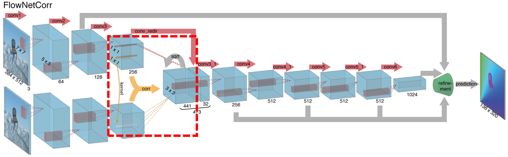

# Taichi Implementation of Correlation Layer

This is a simple [Taichi](https://github.com/taichi-dev/taichi) implementation of Correlation layer used in learning based optical flow estimation, such as [FlowNetC](https://arxiv.org/abs/1504.06852).



Currently, the implementation supports limited parameters when compared with [official](https://github.com/NVIDIA/flownet2-pytorch/tree/master/networks/correlation_package) and other implementations (such as [spatial-correlation-sampler](https://github.com/ClementPinard/Pytorch-Correlation-extension)), but it may satisfy most existing flow networks. 

* Thanks to the JIT compiler frameworks and portability offered by [Taichi](https://github.com/taichi-dev/taichi), the code is easy to read, works out of the box without compiling CUDA codes, and runs both on GPU and CPU;
* It's much faster than [pure PyTorch implementation](https://github.com/limacv/CorrelationLayer).


## Validation

You can use scripts in `tests` folder to validate and benchmark the implementations:

* The forward process is validated with results computed by [spatial-correlation-sampler](https://github.com/ClementPinard/Pytorch-Correlation-extension). Check this by running `python -m tests.check_fwd_with_other_impl`. Note this requires you to install [spatial-correlation-sampler](https://github.com/ClementPinard/Pytorch-Correlation-extension) first.
* Run gradients checks by running `python -m tests.check_grad {cpu, cuda}`;
* Benchmark [Taichi](https://github.com/taichi-dev/taichi) implementation by running `python -m tests.benchmark_taichi {cpu cuda}`;
* Benchmark [pure PyTorch implementation](https://github.com/limacv/CorrelationLayer) by running `python -m tests.benchmark_torch {cpu cuda}`, the code is slightly modified to support `dila_patch` parameter;
* Benchmark [spatial-correlation-sampler](https://github.com/ClementPinard/Pytorch-Correlation-extension) by running `python -m tests.benchmark_other_impl {cpu cuda}`


## Requirements

Codes are tested with `taichi==1.5.0` and `torch==1.13.1`, you can install the latest [Taichi](https://github.com/taichi-dev/taichi) via:

```
pip install --upgrade taichi
```


## Example Usage

The following code snippet uses the same parameters  as use in `FlowNetC` with a batch size of 4, described in [this paper](https://arxiv.org/abs/1504.06852).

```python
import torch
import taichi as ti
from corr_taichi import CorrTaichi

if torch.cuda.is_available():
    device = torch.device("cuda:0")
    ti.init(arch=ti.cuda, device_memory_GB=0.5)
else:
    device = torch.device("cpu")
    ti.init(arch=ti.cpu)

# input tensor shape
B, C, H, W = (4, 256, 48, 64)

# correlation config (same as FlowNetC)
max_displacement = 20
stride2 = 2

kernel = CorrTaichi(
    max_disp=max_displacement,
    dila_patch=stride2
)

x0 = torch.randn((B, C, H, W), device=device, requires_grad=True)
x1 = torch.randn_like(x0, requires_grad=True)
corr: torch.Tensor = kernel(x0, x1)

print("[INFO] Input tensor size: {}".format(x0.size()))  # (4, 256, 48, 64)
print("[INFO] Output tensor size: {}".format(corr.size()))  # (4, 441, 48, 64)
```

Currently, `CorrTaichi`  supports adjusting only two parameters:

* `max_disp`: corresponds to `max_displacement` in the official implementation;
* `dila_patch`: corresponds to `stride2` in the official implementation

For two input tensor `x0`, `x1` with shape `(B, C, H, W)`, the shape of output correlation tensor is `(B, L, H, W)` . `L = patch_size * patch_size`, and `patch_size = max_disp * 2 // dila_patch + 1`. To get the right parameters for `FlowNetC`, you would have `max_disp=20, dila_patch=2`.


## Limitations

* Limited configurations are supported: the official implementation supports following arguments: `pad_size, kernel_size, max_displacement, stride1, stride2, corr_multiply`, this repository only implements `max_displacement` and `stride2` (renamed to `dila_patch`), other parameters are strictly limited to `pad_size=0, kernel_size=1, stride1=1, corr_multiply=1`.
* The code is not optimized. It is ~2x slower than [spatial-correlation-sampler](https://github.com/ClementPinard/Pytorch-Correlation-extension) on my computer. I'm still new to CUDA and Taichi, there should be several techniques to improve the efficiency...


## Benchmark

The correlation parameters are configured as those in `Example Usage`. Results are evaluated on RTX 2070 Super (GPU) and i5-9400F (CPU).

| Implementation              | Device               | Pass     | Avg Time        |
| --------------------------- | -------------------- | -------- | --------------- |
| **this repo**               | RTX 2070 Super (GPU) | forward  | 17.851ms        |
| pure PyTorch                | RTX 2070 Super (GPU) | forward  | 109.124ms       |
| spatial-correlation-sampler | RTX 2070 Super (GPU) | forward  | 9.543ms         |
| **this repo**               | RTX 2070 Super (GPU) | backward | 169.403ms       |
| pure PyTorch                | RTX 2070 Super (GPU) | backward | 566.942ms       |
| spatial-correlation-sampler | RTX 2070 Super (GPU) | backward | 103.387ms       |
| **this repo**               | i5-9400F (CPU)       | forward  | 0.332s          |
| pure PyTorch                | i5-9400F (CPU)       | forward  | 2.248s          |
| spatial-correlation-sampler | i5-9400F (CPU)       | forward  | 11.698s (doubt) |
| **this repo**               | i5-9400F (CPU)       | backward | 4.054s          |
| pure PyTorch                | i5-9400F (CPU)       | backward | 18.697s         |
| spatial-correlation-sampler | i5-9400F (CPU)       | backward | 19.155s (doubt) |

The behavior of spatial-correlation-sampler on CPU is weird. I'm not sure what's wrong.